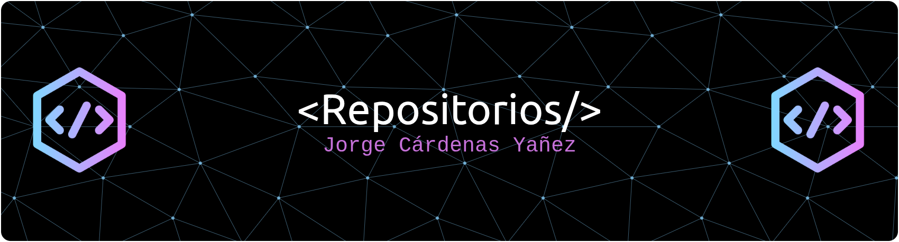

[debo especificar que este Banner es una humorada.]

# ¡Hola! 👋 Soy Jorge Cárdenas

## 🚀 Desarrollador en Formación | Análisis de Datos & Backend

Soy un apasionado desarrollador en formación con enfoque en **análisis de datos** y desarrollo backend con **Django**. Actualmente estoy construciendo mi camino en el mundo de la tecnología, combinando habilidades técnicas con una gran curiosidad por los datos y su transformación en insights valiosos.

---

## 🛠️ Habilidades Técnicas

### **Lenguajes de Programación**
- **Python** - Nivel Intermedio
  - Django Framework
  - Pandas, NumPy para análisis de datos
  - APIs REST

### **Bases de Datos**
- **MySQL** - Nivel Básico
  - Consultas básicas y joins
  - Diseño de bases de datos relacionales
  - Optimización de queries

### **Herramientas de Análisis de Datos**
- **Microsoft Excel** - Nivel Intermedio
  - Tablas dinámicas
  - Funciones avanzadas
  - Gráficos y dashboards

- **Power BI** - Nivel Intermedio
  - Visualización de datos
  - Modelado de datos
  - DAX básico

### **Otras Tecnologías**
- Git & GitHub
- HTML5 & CSS3
- JavaScript básico

---

## 📊 Enfoque Actual

### **Análisis de Datos**
- Transformación y limpieza de datos
- Visualización efectiva
- Análisis exploratorio
- Reportes automatizados

### **Desarrollo Web con Django**
- Creación de aplicaciones web
- APIs RESTful
- Autenticación y autorización
- ORM de Django

---

## 🎯 Objetivos de Aprendizaje

### **A Corto Plazo**
- [ ] Mejorar habilidades en SQL avanzado
- [ ] Profundizar en machine learning con Python
- [ ] Desarrollar proyectos full-stack completos

### **A Largo Plazo**
- [ ] Especializarme en Data Engineering
- [ ] Aprender sobre big data y cloud computing
- [ ] Contribuir a proyectos open source

---

## 📈 Estadísticas de GitHub

---

## 📫 Conectemos!

¡Me encanta conocer a otros desarrolladores y aprender juntos! No dudes en contactarme:

---

## 💡 Filosofía de Desarrollo

> "Cada línea de código es una oportunidad para aprender y cada dataset es una historia esperando ser contada."

---

*¡Siempre abierto a nuevas oportunidades de colaboración y aprendizaje!* 🚀

